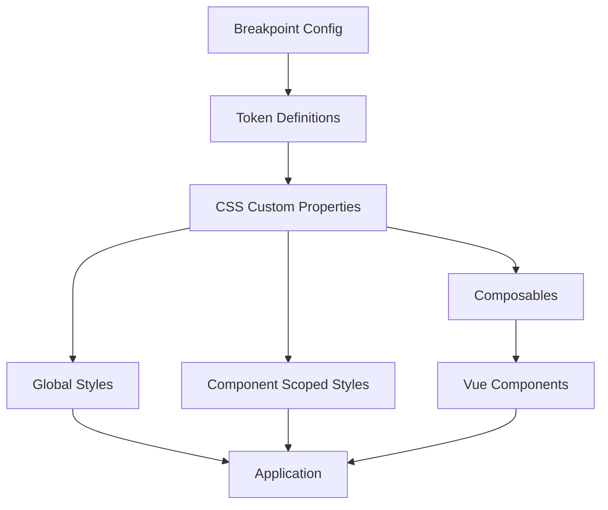

# Design Document: Responsive Styling System

## Overview

The Responsive Styling System provides a maintainable approach to handle responsive design in a Nuxt 3 application. The system leverages CSS custom properties (CSS variables) combined with media queries to create responsive tokens that automatically adapt to different screen sizes. This approach eliminates repetitive media queries in component code while maintaining flexibility and performance.

The system consists of three main components:
1. **Breakpoint Configuration**: Centralized definition of screen size breakpoints
2. **Responsive Tokens**: CSS custom properties that change values across breakpoints
3. **Integration Layer**: Utilities and composables for using responsive tokens in Vue components

## Architecture

### High-Level Architecture



### Design Approach

The system uses a **CSS-first approach** with CSS custom properties as the primary mechanism for responsive values. This approach offers several advantages:

1. **Performance**: CSS custom properties are evaluated by the browser's CSS engine, avoiding JavaScript overhead
2. **Cascading**: Values naturally cascade through the component tree
3. **Dynamic Updates**: Media queries automatically update custom property values when breakpoints change
4. **Developer Experience**: Familiar CSS syntax with enhanced maintainability

### File Structure

```
assets/
  styles/
    responsive/
      breakpoints.css       # Breakpoint definitions and media queries
      tokens.css           # Responsive token definitions
      index.css            # Main entry point
    main.css              # Global styles (imports responsive system)
composables/
  useResponsive.ts        # Vue composable for responsive utilities
```

## Components and Interfaces

### 1. Breakpoint Configuration (breakpoints.css)

This file defines the breakpoint values and establishes the foundation for responsive tokens.

**Structure:**
```css
/* Breakpoint definitions as CSS custom properties */
:root {
  --breakpoint-mobile: 0;
  --breakpoint-tablet: 768px;
  --breakpoint-desktop: 1024px;
}
```

**Responsibilities:**
- Define breakpoint threshold values
- Provide a single source of truth for screen size ranges
- Make breakpoint values accessible throughout the application

### 2. Responsive Tokens (tokens.css)

This file defines responsive tokens using CSS custom properties that change values across breakpoints.

**Token Categories:**

**Typography Tokens:**
```css
:root {
  /* Hero title */
  --font-size-hero: 3rem;        /* Mobile default */
  --font-size-h1: 2rem;
  --font-size-h2: 1.5rem;
  --font-size-h3: 1.25rem;
  --font-size-body: 1rem;
  --font-size-small: 0.875rem;
}

@media (min-width: 768px) {
  :root {
    --font-size-hero: 5rem;      /* Tablet */
    --font-size-h1: 2.5rem;
    --font-size-h2: 2rem;
    --font-size-h3: 1.5rem;
    --font-size-body: 1.125rem;
  }
}

@media (min-width: 1024px) {
  :root {
    --font-size-hero: 8rem;      /* Desktop */
    --font-size-h1: 3rem;
    --font-size-h2: 2.5rem;
    --font-size-h3: 1.75rem;
    --font-size-body: 1.125rem;
  }
}
```

**Spacing Tokens:**
```css
:root {
  /* Spacing scale */
  --spacing-xs: 0.25rem;         /* 4px */
  --spacing-sm: 0.5rem;          /* 8px */
  --spacing-md: 1rem;            /* 16px */
  --spacing-lg: 1.5rem;          /* 24px */
  --spacing-xl: 2rem;            /* 32px */
  --spacing-2xl: 3rem;           /* 48px */
  --spacing-3xl: 4rem;           /* 64px */
}

@media (min-width: 768px) {
  :root {
    --spacing-lg: 2rem;          /* 32px */
    --spacing-xl: 3rem;          /* 48px */
    --spacing-2xl: 4rem;         /* 64px */
    --spacing-3xl: 6rem;         /* 96px */
  }
}

@media (min-width: 1024px) {
  :root {
    --spacing-xl: 4rem;          /* 64px */
    --spacing-2xl: 6rem;         /* 96px */
    --spacing-3xl: 8rem;         /* 128px */
  }
}
```

**Responsibilities:**
- Define responsive token values for each breakpoint
- Use mobile-first approach (smallest values as defaults)
- Organize tokens by category (typography, spacing, etc.)
- Ensure consistent naming conventions

### 3. Main Entry Point (index.css)

This file imports all responsive system files in the correct order.

**Structure:**
```css
@import './breakpoints.css';
@import './tokens.css';
```

**Responsibilities:**
- Ensure correct loading order of responsive system files
- Provide a single import point for the responsive system

### 4. Global Styles Integration (main.css)

The existing main.css file will import the responsive system.

**Integration:**
```css
/* Import responsive system */
@import './responsive/index.css';

/* Existing global styles can now use responsive tokens */
body {
  font-size: var(--font-size-body);
  line-height: 1.6;
}

h1 {
  font-size: var(--font-size-h1);
  margin-bottom: var(--spacing-lg);
}
```

### 5. Vue Composable (useResponsive.ts)

A Vue composable that provides utilities for working with responsive values in component logic.

**Interface:**
```typescript
interface ResponsiveComposable {
  // Get current breakpoint name
  currentBreakpoint: Ref<'mobile' | 'tablet' | 'desktop'>;
  
  // Check if current breakpoint matches
  isMobile: Ref<boolean>;
  isTablet: Ref<boolean>;
  isDesktop: Ref<boolean>;
  
  // Check if viewport is at least a certain breakpoint
  isTabletOrLarger: Ref<boolean>;
  isDesktopOrLarger: Ref<boolean>;
}

export function useResponsive(): ResponsiveComposable;
```

**Implementation Approach:**
- Use `window.matchMedia()` to detect breakpoint changes
- Create reactive refs that update when breakpoints change
- Clean up event listeners on component unmount
- Handle SSR by providing safe defaults

**Usage Example:**
```typescript
<script setup>
import { useResponsive } from '~/composables/useResponsive';

const { isMobile, currentBreakpoint } = useResponsive();

// Conditionally render or compute based on breakpoint
const itemsPerRow = computed(() => {
  return isMobile.value ? 1 : 3;
});
</script>
```

### 6. Component Integration

Components can use responsive tokens in three ways:

**A. In Scoped Styles:**
```vue
<style scoped>
.hero-title {
  font-size: var(--font-size-hero);
  margin-bottom: var(--spacing-xl);
}

.card {
  padding: var(--spacing-md);
  gap: var(--spacing-sm);
}
</style>
```

**B. In Template with Inline Styles (when dynamic):**
```vue
<template>
  <div :style="{ padding: 'var(--spacing-lg)' }">
    Content
  </div>
</template>
```

**C. With Composable (for logic-based responsive behavior):**
```vue
<script setup>
import { useResponsive } from '~/composables/useResponsive';

const { isMobile } = useResponsive();
</script>

<template>
  <div v-if="isMobile">Mobile-specific content</div>
  <div v-else>Desktop content</div>
</template>
```

## Data Models

### Breakpoint Configuration

```typescript
interface BreakpointConfig {
  mobile: {
    min: number;    // 0
    max: number;    // 767
  };
  tablet: {
    min: number;    // 768
    max: number;    // 1023
  };
  desktop: {
    min: number;    // 1024
    max: number;    // Infinity
  };
}
```

### Token Definition

```typescript
interface ResponsiveToken {
  name: string;           // e.g., '--font-size-hero'
  category: 'typography' | 'spacing' | 'layout';
  values: {
    mobile: string;       // e.g., '3rem'
    tablet: string;       // e.g., '5rem'
    desktop: string;      // e.g., '8rem'
  };
}
```

### Composable State

```typescript
interface ResponsiveState {
  currentBreakpoint: 'mobile' | 'tablet' | 'desktop';
  viewportWidth: number;
  isMobile: boolean;
  isTablet: boolean;
  isDesktop: boolean;
  isTabletOrLarger: boolean;
  isDesktopOrLarger: boolean;
}
```


## Correctness Properties

*A property is a characteristic or behavior that should hold true across all valid executions of a system—essentially, a formal statement about what the system should do. Properties serve as the bridge between human-readable specifications and machine-verifiable correctness guarantees.*

### Property 1: Token values match breakpoint

*For any* responsive token (typography or spacing) and any viewport width, the computed CSS custom property value should match the expected value for the current breakpoint (mobile: 0-767px, tablet: 768-1023px, desktop: 1024px+).

**Validates: Requirements 2.1, 3.1**

### Property 2: Breakpoint transitions update all tokens

*For any* responsive token, when the viewport width crosses a breakpoint threshold (e.g., from 767px to 768px), the computed CSS custom property value should change to reflect the new breakpoint's value.

**Validates: Requirements 2.3, 3.4, 7.2**

### Property 3: Typography hierarchy preservation

*For any* breakpoint, the font size hierarchy should be preserved such that: hero > h1 > h2 > h3 > body > small, meaning each level should have a computed font size greater than or equal to the next level.

**Validates: Requirements 2.5**

## Error Handling

### CSS Custom Property Fallbacks

**Issue**: CSS custom properties may not be supported in very old browsers.

**Solution**: Provide fallback values using the CSS custom property fallback syntax:
```css
.element {
  font-size: 1rem; /* fallback */
  font-size: var(--font-size-body, 1rem); /* with fallback */
}
```

**Strategy**: For critical styles, always provide a fallback value as the second argument to `var()`.

### Missing Token References

**Issue**: A component might reference a token that doesn't exist.

**Solution**: 
- CSS will gracefully handle missing custom properties by using the fallback value if provided
- During development, browser DevTools will show warnings for undefined custom properties
- Establish naming conventions and documentation to prevent typos

**Strategy**: Use consistent naming patterns and provide comprehensive token documentation.

### SSR Considerations

**Issue**: The `useResponsive` composable relies on `window.matchMedia()`, which is not available during server-side rendering.

**Solution**: Implement SSR-safe defaults in the composable:
```typescript
export function useResponsive() {
  // Check if running in browser
  if (process.client) {
    // Use matchMedia for reactive breakpoint detection
  } else {
    // Return safe defaults for SSR
    return {
      currentBreakpoint: ref('desktop'),
      isMobile: ref(false),
      isTablet: ref(false),
      isDesktop: ref(true),
      isTabletOrLarger: ref(true),
      isDesktopOrLarger: ref(true),
    };
  }
}
```

**Strategy**: Default to desktop breakpoint during SSR to avoid layout shifts, then hydrate with actual breakpoint on client.

### Breakpoint Transition Flicker

**Issue**: When resizing the browser window across breakpoints, there might be a brief flicker as CSS custom properties update.

**Solution**: 
- CSS custom property updates are handled by the browser's CSS engine and are typically smooth
- For critical animations during breakpoint transitions, use CSS transitions:
```css
.element {
  font-size: var(--font-size-hero);
  transition: font-size 0.2s ease;
}
```

**Strategy**: Apply transitions selectively to elements where smooth breakpoint transitions are important.

### Invalid Token Values

**Issue**: A token might be defined with an invalid CSS value.

**Solution**:
- CSS will ignore invalid property values and fall back to inherited or initial values
- Use CSS validation during development
- Establish token value patterns (e.g., always use rem units for font sizes)

**Strategy**: Document token value requirements and validate during code review.

## Testing Strategy

The responsive styling system will be tested using a dual approach: unit tests for specific examples and edge cases, and property-based tests for universal properties.

### Unit Testing Approach

Unit tests will focus on:

1. **Configuration Validation**: Verify that breakpoint configurations contain correct values
2. **Token Existence**: Verify that required tokens are defined in the CSS
3. **Specific Examples**: Test specific scenarios like hero title scaling on mobile
4. **Integration Points**: Test that tokens work in scoped styles, global styles, and inline styles
5. **Composable Functionality**: Test that `useResponsive` composable returns correct values
6. **Migration Compatibility**: Test that existing styles work alongside responsive tokens

**Testing Tools**:
- **Vitest**: For unit testing JavaScript/TypeScript code
- **@vue/test-utils**: For testing Vue components
- **jsdom**: For simulating browser environment and CSS custom properties
- **happy-dom**: Alternative to jsdom with better CSS support

**Example Unit Test**:
```typescript
import { describe, it, expect } from 'vitest';
import { mount } from '@vue/test-utils';

describe('Responsive Tokens', () => {
  it('should define hero font size token', () => {
    const element = document.createElement('div');
    document.body.appendChild(element);
    
    const styles = getComputedStyle(element);
    const heroSize = styles.getPropertyValue('--font-size-hero');
    
    expect(heroSize).toBeTruthy();
  });
  
  it('should scale hero title down on mobile', () => {
    // Set viewport to mobile width
    Object.defineProperty(window, 'innerWidth', { value: 375 });
    
    const element = document.createElement('div');
    element.style.fontSize = 'var(--font-size-hero)';
    document.body.appendChild(element);
    
    const styles = getComputedStyle(element);
    const fontSize = parseFloat(styles.fontSize);
    
    // Mobile hero should be smaller than desktop (8rem = 128px)
    expect(fontSize).toBeLessThan(128);
  });
});
```

### Property-Based Testing Approach

Property-based tests will verify universal properties across many generated inputs. Each property test will run a minimum of 100 iterations to ensure comprehensive coverage.

**Testing Tools**:
- **fast-check**: Property-based testing library for JavaScript/TypeScript
- Custom generators for viewport widths, token names, and breakpoint scenarios

**Property Test Configuration**:
- Minimum 100 iterations per test
- Each test tagged with feature name and property reference
- Tag format: `Feature: responsive-styling-system, Property {N}: {description}`

**Example Property Test**:
```typescript
import { describe, it } from 'vitest';
import fc from 'fast-check';

describe('Property Tests', () => {
  it('Property 1: Token values match breakpoint', () => {
    // Feature: responsive-styling-system, Property 1: Token values match breakpoint
    
    fc.assert(
      fc.property(
        fc.integer({ min: 320, max: 1920 }), // viewport width
        fc.constantFrom('--font-size-hero', '--font-size-h1', '--spacing-lg'), // token name
        (viewportWidth, tokenName) => {
          // Set viewport width
          Object.defineProperty(window, 'innerWidth', { value: viewportWidth });
          
          // Get computed token value
          const element = document.createElement('div');
          document.body.appendChild(element);
          const computedValue = getComputedStyle(element).getPropertyValue(tokenName);
          
          // Determine expected breakpoint
          const breakpoint = viewportWidth < 768 ? 'mobile' 
                           : viewportWidth < 1024 ? 'tablet' 
                           : 'desktop';
          
          // Get expected value for this breakpoint
          const expectedValue = getExpectedTokenValue(tokenName, breakpoint);
          
          // Verify computed value matches expected
          return computedValue.trim() === expectedValue;
        }
      ),
      { numRuns: 100 }
    );
  });
  
  it('Property 2: Breakpoint transitions update all tokens', () => {
    // Feature: responsive-styling-system, Property 2: Breakpoint transitions update all tokens
    
    fc.assert(
      fc.property(
        fc.constantFrom('--font-size-hero', '--font-size-h1', '--spacing-lg', '--spacing-xl'),
        (tokenName) => {
          const element = document.createElement('div');
          document.body.appendChild(element);
          
          // Test transition from mobile to tablet (767px -> 768px)
          Object.defineProperty(window, 'innerWidth', { value: 767 });
          const valueBefore = getComputedStyle(element).getPropertyValue(tokenName);
          
          Object.defineProperty(window, 'innerWidth', { value: 768 });
          // Trigger media query re-evaluation
          window.dispatchEvent(new Event('resize'));
          const valueAfter = getComputedStyle(element).getPropertyValue(tokenName);
          
          // Value should change across breakpoint
          return valueBefore !== valueAfter;
        }
      ),
      { numRuns: 100 }
    );
  });
  
  it('Property 3: Typography hierarchy preservation', () => {
    // Feature: responsive-styling-system, Property 3: Typography hierarchy preservation
    
    fc.assert(
      fc.property(
        fc.integer({ min: 320, max: 1920 }), // viewport width
        (viewportWidth) => {
          Object.defineProperty(window, 'innerWidth', { value: viewportWidth });
          
          const element = document.createElement('div');
          document.body.appendChild(element);
          const styles = getComputedStyle(element);
          
          // Get all typography token values
          const hero = parseFloat(styles.getPropertyValue('--font-size-hero'));
          const h1 = parseFloat(styles.getPropertyValue('--font-size-h1'));
          const h2 = parseFloat(styles.getPropertyValue('--font-size-h2'));
          const h3 = parseFloat(styles.getPropertyValue('--font-size-h3'));
          const body = parseFloat(styles.getPropertyValue('--font-size-body'));
          const small = parseFloat(styles.getPropertyValue('--font-size-small'));
          
          // Verify hierarchy: hero > h1 > h2 > h3 > body > small
          return hero >= h1 && h1 >= h2 && h2 >= h3 && h3 >= body && body >= small;
        }
      ),
      { numRuns: 100 }
    );
  });
});
```

### Test Coverage Goals

- **Unit Tests**: Cover all specific examples, edge cases, and integration points
- **Property Tests**: Cover all universal properties (3 properties identified)
- **Component Tests**: Verify that real Vue components can use responsive tokens correctly
- **E2E Tests**: Optional - verify responsive behavior in actual browser environments

### Testing Challenges

**Challenge 1: Simulating Media Queries in Tests**
- jsdom and happy-dom have limited media query support
- Solution: Use viewport width manipulation and manual media query evaluation, or use Playwright for E2E tests with real browser rendering

**Challenge 2: CSS Custom Property Computation**
- Test environments may not fully compute CSS custom properties
- Solution: Use happy-dom which has better CSS support, or test in real browser with Playwright

**Challenge 3: SSR Testing**
- Need to test both server and client behavior
- Solution: Use Nuxt's testing utilities to test SSR and client hydration separately

### Continuous Integration

All tests should run in CI/CD pipeline:
- Run unit tests on every commit
- Run property tests on every commit (100 iterations each)
- Run component tests on every pull request
- Optional: Run E2E tests on main branch merges
